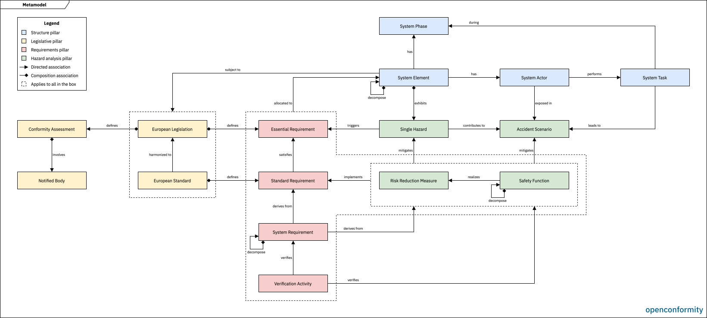

# Metamodel

This document defines the metamodel, the entity types a model may contain and the relationships allowed between them. It transcribes the diagram maintained in [metamodel.drawio](../sources/metamodel.drawio), which is the editable original.

## 1. Concept

A model describes the CE marking work for one machinery product. Everything in the model is an entity of a defined type, carrying its own attributes and connected to other entities through typed relationships. The metamodel defines those types and connections, and so what a model is able to express.

The metamodel encodes the domain knowledge of CE marking of machinery. It follows the structure of the work itself, where legislation defines requirements, hazards trigger them, measures reduce the risks, and requirements follow from the measures. The entity types name the things the work produces, and the relationships name the connections between them.

The metamodel is built into the software and versioned with it. A user-extensible metamodel is out of scope, since the value lies in a metamodel that is correct for the domain, not in generic modelling capability.

## 2. Definition

### 2.1 Diagram

### 2.2 Pillars

| Pillar | Description |
|---|---|
| System Context | Defining the machinery and its operational context |
| Legislative Framework | Identifying the applicable legislation and standards |
| Requirements Definition | Deriving the requirements and verification activities |
| Hazard Analysis | Identifying the hazards and reducing the risks |

### 2.3 Entities

| Prefix | Entity | Pillar |
|---|---|---|
| LEG | European Legislation | Legislative |
| STD | European Standard | Legislative |
| CAS | Conformity Assessment | Legislative |
| NTB | Notified Body | Legislative |
| ESR | Essential Requirement | Requirements |
| STR | Standard Requirement | Requirements |
| REQ | System Requirement | Requirements |
| VER | Verification Activity | Requirements |
| HAZ | Single Hazard | Hazard Analysis |
| SCN | Accident Scenario | Hazard Analysis |
| RRM | Risk Reduction Measure | Hazard Analysis |
| SAF | Safety Function | Hazard Analysis |
| ELM | System Element | Structure |
| ACT | System Actor | Structure |
| TSK | System Task | Structure |
| PHS | System Phase | Structure |

### 2.4 Relationships

| Source | Relationship | Target | Kind |
|---|---|---|---|
| LEG | defines | ESR | Composition |
| LEG | defines | CAS | Composition |
| STD | defines | STR | Composition |
| CAS | involves | NTB | Composition |
| STD | harmonised to | LEG | Association |
| ELM | subject to | LEG | Association |
| ELM | subject to | STD | Association |
| STR | satisfies | ESR | Association |
| REQ | derives from | STR | Association |
| REQ | derives from | RRM | Association |
| REQ | derives from | SAF | Association |
| REQ | decomposes into | REQ | Composition |
| SAF | decomposes into | SAF | Composition |
| ELM | decomposes into | ELM | Composition |
| ESR | allocated to | ELM | Association |
| STR | allocated to | ELM | Association |
| REQ | allocated to | ELM | Association |
| VER | allocated to | ELM | Association |
| RRM | allocated to | ELM | Association |
| SAF | allocated to | ELM | Association |
| VER | verifies | REQ | Association |
| VER | verifies | RRM | Association |
| VER | verifies | SAF | Association |
| RRM | implements | STR | Association |
| SAF | realises | RRM | Association |
| RRM | mitigates | HAZ | Association |
| RRM | mitigates | SCN | Association |
| ELM | exhibits | HAZ | Composition |
| HAZ | triggers | ESR | Association |
| HAZ | contributes to | SCN | Association |
| TSK | leads to | SCN | Association |
| ACT | exposed in | SCN | Association |
| ELM | has | PHS | Association |
| ELM | has | ACT | Association |
| ACT | performs | TSK | Association |
| TSK | during | PHS | Association |

### 2.5 Attributes

#### 2.5.1 European Legislation

*Not started yet.*

#### 2.5.2 European Standard

*Not started yet.*

#### 2.5.3 Conformity Assessment

*Not started yet.*

#### 2.5.4 Notified Body

*Not started yet.*

#### 2.5.5 Essential Requirement

*Not started yet.*

#### 2.5.6 Standard Requirement

*Not started yet.*

#### 2.5.7 System Requirement

*Not started yet.*

#### 2.5.8 Verification Activity

*Not started yet.*

#### 2.5.9 Single Hazard

*Not started yet.*

#### 2.5.10 Accident Scenario

*Not started yet.*

#### 2.5.11 Risk Reduction Measure

*Not started yet.*

#### 2.5.12 Safety Function

*Not started yet.*

#### 2.5.12 System Element

*Not started yet.*

#### 2.5.12 System Actor

*Not started yet.*

#### 2.5.12 System Task

*Not started yet.*

#### 2.5.12 System Phase

*Not started yet.*

## 3. Semantics

### 3.1 Enforcement

The software enforces the metamodel. Only the entity types listed in 2.3 can be created, and only the relationships listed in 2.4 can be established between them. A relationship not present in that table cannot exist in a model.

### 3.2 Deletion

Deleting an entity removes it from the model together with the relationships it takes part in. Deleting an association removes the connection and leaves both entities in place.

Composition carries ownership, so deleting the source entity also deletes the entities it owns. A Single Hazard belongs to exactly one System Element and is deleted with it, and the requirements defined by a legislation or a standard are deleted together with it. The software states which entities are affected before performing a deletion that cascades.

### 3.3 Cardinality

XXX

## 4. References

| No. | Reference | Link |
|---|---|---|
| *[1]* | *Reference*| *Link* |
