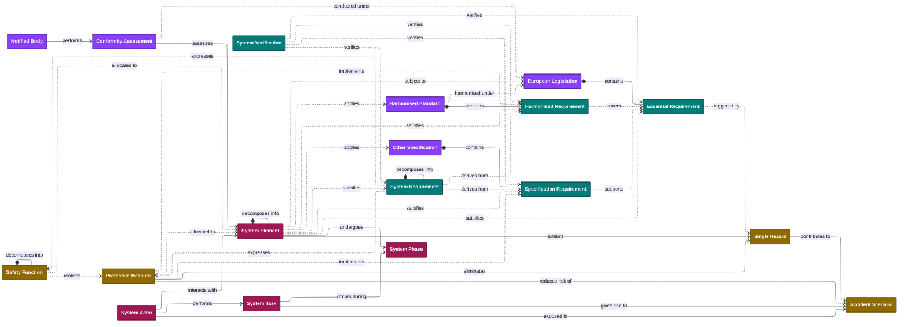

```mermaid
---
config:
  layout: elk
  class:
    hideEmptyMembersBox: true
---
classDiagram
direction LR

class LEG["European Legislation"]:::legislativeFramework
class HST["Harmonised Standard"]:::legislativeFramework
class OSP["Other Specification"]:::legislativeFramework
class CAS["Conformity Assessment"]:::legislativeFramework
class NTB["Notified Body"]:::legislativeFramework
class ESR["Essential Requirement"]:::requirementsDefinition
class HSR["Harmonised Requirement"]:::requirementsDefinition
class SPR["Specification Requirement"]:::requirementsDefinition
class REQ["System Requirement"]:::requirementsDefinition
class VER["System Verification"]:::requirementsDefinition
class HAZ["Single Hazard"]:::riskAssessment
class SCN["Accident Scenario"]:::riskAssessment
class PRM["Protective Measure"]:::riskAssessment
class SAF["Safety Function"]:::riskAssessment
class ELM["System Element"]:::systemContext
class ACT["System Actor"]:::systemContext
class TSK["System Task"]:::systemContext
class PHS["System Phase"]:::systemContext

%% Composition
LEG *-- ESR : contains
HST *-- HSR : contains
OSP *-- SPR : contains
REQ *-- REQ : decomposes into
SAF *-- SAF : decomposes into
ELM *-- ELM : decomposes into

%% Dependencies
HST ..> LEG : harmonised under
CAS ..> LEG : conducted under
ELM ..> LEG : subject to
ELM ..> HST : applies
ELM ..> OSP : applies
HSR ..> ESR : covers
SPR ..> ESR : supports
ESR ..> HAZ : triggered by
REQ ..> HSR : derives from
REQ ..> SPR : derives from
REQ ..> PRM : expresses
REQ ..> SAF : expresses
ELM ..> ESR : satisfies
ELM ..> HSR : satisfies
ELM ..> SPR : satisfies
ELM ..> REQ : satisfies
PRM ..> HSR : implements
PRM ..> SPR : implements
VER ..> ESR : verifies
VER ..> HSR : verifies
VER ..> SPR : verifies
VER ..> REQ : verifies
PRM ..> ELM : allocated to
SAF ..> ELM : allocated to
SAF ..> PRM : realises

%% Associations
NTB --> CAS : performs
CAS --> ELM : assesses
ELM --> HAZ : exhibits
HAZ --> SCN : contributes to
TSK --> SCN : gives rise to
ACT --> SCN : exposed in
PRM --> HAZ : eliminates
PRM --> SCN : reduces risk of
ELM --> PHS : undergoes
ACT --> ELM : interacts with
ACT --> TSK : performs
TSK --> PHS : occurs during

classDef legislativeFramework fill:#8A3FFC,stroke:#491D8B,color:#FFFFFF
classDef requirementsDefinition fill:#007D79,stroke:#004144,color:#FFFFFF
classDef riskAssessment fill:#8E6A00,stroke:#684E00,color:#FFFFFF
classDef systemContext fill:#9F1853,stroke:#740937,color:#FFFFFF
```