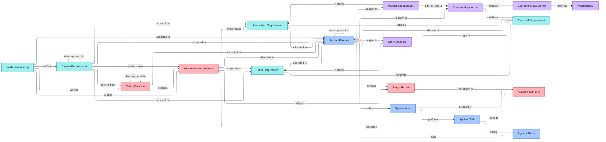

```mermaid
%%{init: {'flowchart': {'defaultRenderer': 'elk', 'curve': 'basis'}}}%%
flowchart LR
LEG[European Legislation]
HST[Harmonised Standard]
OST[Other Standard]
CAS[Conformity Assessment]
NTB[Notified Body]
ESR[Essential Requirement]
HSR[Harmonised Requirement]
OSR[Other Requirement]
REQ[System Requirement]
VER[Verification Activity]
HAZ[Single Hazard]
SCN[Accident Scenario]
RRM[Risk Reduction Measure]
SAF[Safety Function]
ELM[System Element]
ACT[System Actor]
TSK[System Task]
PHS[System Phase]

LEG -->|defines| ESR
LEG -->|defines| CAS
HST -->|defines| HSR
OST -->|defines| OSR
CAS -->|involves| NTB
HST -->|harmonised to| LEG
ELM -->|subject to| LEG
ELM -->|subject to| HST
ELM -->|subject to| OST
HSR -->|satisfies| ESR
OSR -->|supports| ESR
REQ -->|derives from| HSR
REQ -->|derives from| OSR
REQ -->|derives from| RRM
REQ -->|derives from| SAF
REQ -->|decomposes into| REQ
SAF -->|decomposes into| SAF
ELM -->|decomposes into| ELM
ESR -->|allocated to| ELM
HSR -->|allocated to| ELM
OSR -->|allocated to| ELM
REQ -->|allocated to| ELM
VER -->|allocated to| ELM
RRM -->|allocated to| ELM
SAF -->|allocated to| ELM
VER -->|verifies| REQ
VER -->|verifies| RRM
VER -->|verifies| SAF
RRM -->|implements| HSR
RRM -->|implements| OSR
SAF -->|realises| RRM
RRM -->|mitigates| HAZ
RRM -->|mitigates| SCN
ELM -->|exhibits| HAZ
HAZ -->|triggers| ESR
HAZ -->|contributes to| SCN
TSK -->|leads to| SCN
ACT -->|exposed in| SCN
ELM -->|has| PHS
ELM -->|has| ACT
ACT -->|performs| TSK
TSK -->|during| PHS

classDef legislativeFramework fill:#d4bbff,stroke:#6929c4,color:#161616
classDef requirementsDefinition fill:#9ef0f0,stroke:#005d5d,color:#161616
classDef riskAssessment fill:#ffb3b8,stroke:#a2191f,color:#161616
classDef systemStructure fill:#a6c8ff,stroke:#0043ce,color:#161616

class LEG,HST,OST,CAS,NTB legislativeFramework
class ESR,HSR,OSR,REQ,VER requirementsDefinition
class HAZ,SCN,RRM,SAF riskAssessment
class ELM,ACT,TSK,PHS systemStructure
```